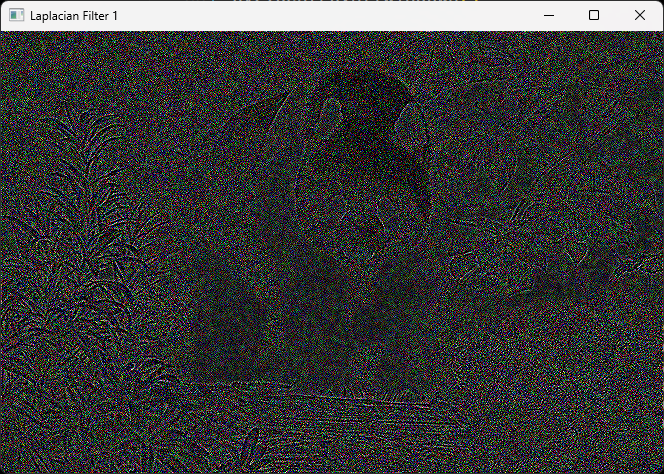
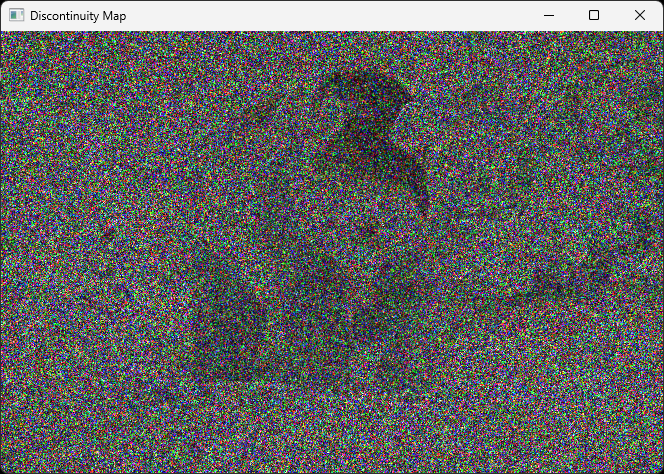
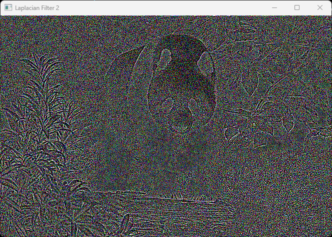
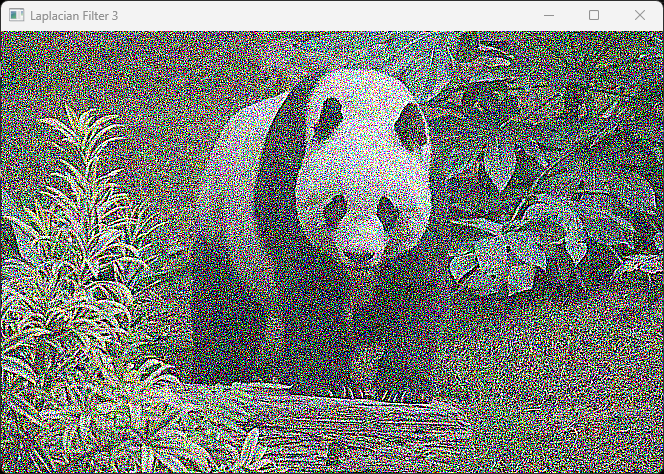
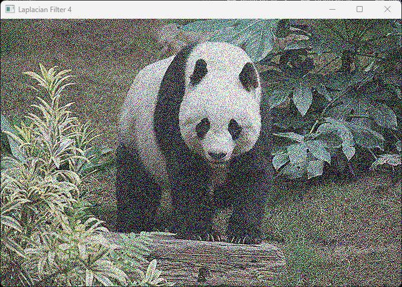
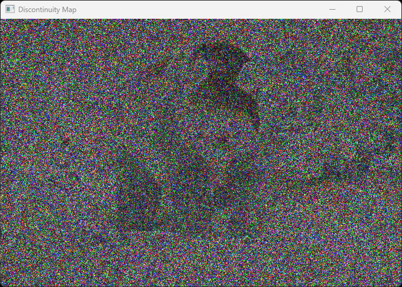

# Repo for doing Spatial Filtering Experiments

## Image Quality Metrics

| PSNR Value(db) | Image Quality |
|----------------|---------------|
| 20-25          | Poor          |
| 25-30          | Fair          |
| 30-35          | Good          |
| 35-40          | Very Good     |
| 40-45          | Excellent     |
| 45-50          | Outstanding   |

## Results

### Original Image

    
Click to see original image

    

### Gaussian Noise

    
Click to see Gaussian Noise

    

    PSNR Value: 20.58368544669303

### Average Filter

  
Click to see Average Filter

  

    

      
      
PSNR Value: 26.33309099007021

    

    

      
      
PSNR Value: 24.310281233950995

    

    

      
      
PSNR Value: 22.732591750197635

    

    

      
      
PSNR Value: 21.6794322779748

    

    

      
      
PSNR Value: 20.936952533749707

    

    

      
      
PSNR Value: 20.38232158818918

    

    

      
      
PSNR Value: 19.940615859021648

    

  

| Kernel Size | PSNR Value |
|----------------|---------------|
| 3          | 26.33309099007021 |
| 5          | 24.310281233950995 |
| 7          | 22.732591750197635 |
| 9          | 21.6794322779748 |
| 11         | 20.936952533749707 |
| 13         | 20.38232158818918 |
| 15         | 19.940615859021648 |

### Gaussian Filter

  
Click to see Gaussian Filter

  

    

      
      
PSNR Value: 26.76677174127444

    

    

      
      
PSNR Value: 26.42952276805162

    

    

      
      
PSNR Value: 25.206562850970506

    

    

      
      
PSNR Value: 24.36226725280244

    

    

      
      
PSNR Value: 23.609264920207846

    

    

      
      
PSNR Value: 22.970936336497342

    

    

      
      
PSNR Value: 22.44196861753025

    

  

| Kernel Size | PSNR Value |
|----------------|---------------|
| 3          | 26.76677174127444 |
| 5          | 26.42952276805162 |
| 7          | 25.206562850970506 |
| 9          | 24.36226725280244 |
| 11         | 23.609264920207846 |
| 13         | 22.970936336497342 |
| 15         | 22.44196861753025 |

### Laplacian Filter and Discontinuity Map

  
Click to see Laplacian Filter and respective Discontinuity Map

  

    

      
    

    

      
      
PSNR Value: 7.642565281014162

    

  

  

    

      
    

    

      
      
PSNR Value: 6.432201648386924

    

  

  

    

      
    

    

      
      
PSNR Value: 7.4557307035857345

    

  

  

    

      
    

    

      
      
PSNR Value: 9.239515678118183

    

  

| Filter Type | PSNR Value |
|----------------|---------------|
| 1          | 7.642565281014162 |
| 2          | 6.432201648386924 |
| 3          | 7.4557307035857345 |
| 4          | 9.239515678118183 |
