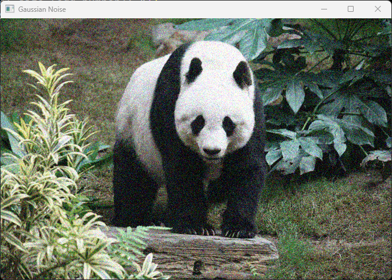
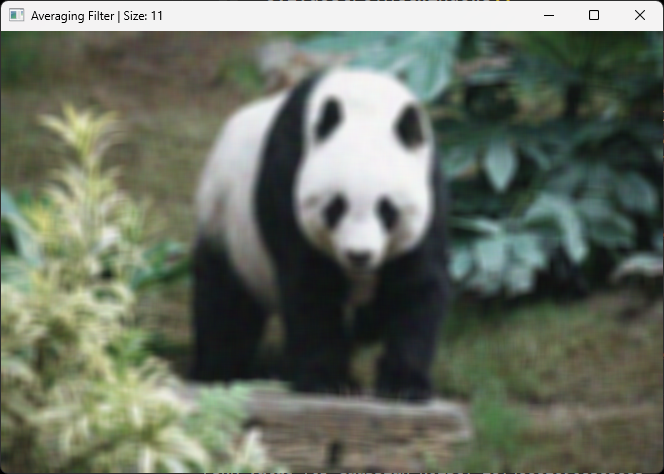
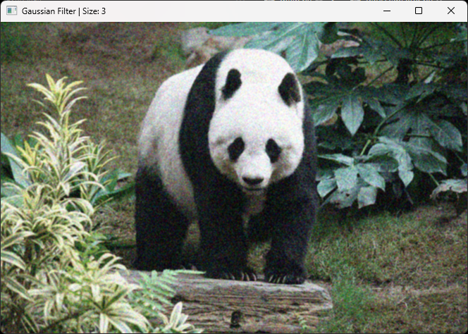
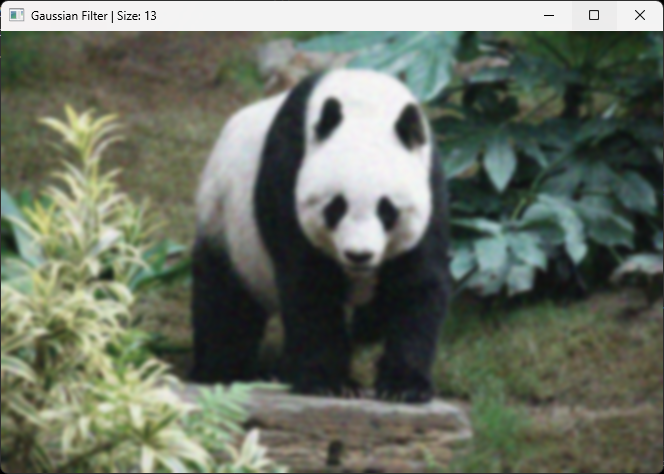

# Repo for doing Spatial Filtering Experiments

## Image Quality Metrics

| PSNR Value(db) | Image Quality |
|----------------|---------------|
| 20-25          | Poor          |
| 25-30          | Fair          |
| 30-35          | Good          |
| 35-40          | Very Good     |
| 40-45          | Excellent     |
| 45-50          | Outstanding   |

## Results

### Original Image

    
Click to see original image

    

### Gaussian Noise

    
Click to see Gaussian Noise

    

    PSNR Value: 28.465816908383683

### Average Filter

    
Click to see Average Filter

    
     
    PSNR Value: 29.965055107560286
     
    
     
    PSNR Value: 29.904465813361007
     
    
     
    PSNR Value: 29.697441909140725
     
    
     
    PSNR Value: 29.495344070199316
     
    
     
    PSNR Value: 29.334058918952
     
    
         
    PSNR Value: 29.19955485328828
     
    
     
    PSNR Value: 29.08838296541164

| Kernel Size | PSNR Value |
|----------------|---------------|
| 3          | 29.965055107560286 |
| 5          | 29.904465813361007 |
| 7          | 29.697441909140725 |
| 9          | 29.495344070199316 |
| 11          | 29.334058918952 |
| 13          | 29.19955485328828 |
| 15          | 29.08838296541164 |

### Gaussian Filter

    
Click to see Gaussian Filter

    
     
    PSNR Value: 29.97165671078848
     
    
     
    PSNR Value: 30.143518513370328
     
    
     
    PSNR Value: 30.08273389479816
     
    
     
    PSNR Value: 29.973509681799108
     
    
     
    PSNR Value: 29.852697831785207
     
    
     
    PSNR Value: 29.73027400582051
     
    
     
    PSNR Value: 29.61809051375578

| Kernel Size | PSNR Value |
|----------------|---------------|
| 3          | 29.97165671078848 |
| 5          | 30.143518513370328 |
| 7          | 30.08273389479816 |
| 9          | 29.973509681799108 |
| 11          | 29.852697831785207 |
| 13          | 29.73027400582051 |
| 15          | 29.61809051375578 |
